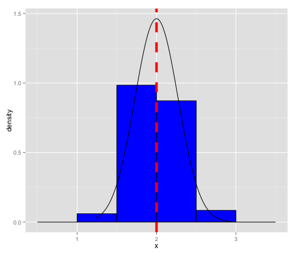

## Central Limit Theorem

The Central Limit Theorem (CLT) states that, given certain conditions, the arithmetic mean of a sufficiently large number of iterates of independent random variables, each with a well-defined expected value and well-defined variance, will be approximately normally distributed, regardless of the underlying distribution.

--- .class #id 

## Exponential Distribution

Exponential Distribution in R is computed using 
```
rexp(n,lambda)
```
For this scenario, we use n will be 50 (iterations) and lambda as 0.5.

We will try for 500 simulations and see if CLT is good.

---

## Simulating for 500
The code below does the simulation and Plots the graph


```r
sampleMeans <- data.frame(x = sapply(sim, function(x) {mean(rexp(n, lambda))}))
sampleMean <- mean(sampleMeans$x)
theoreticalMean <- 1/lambda
variance <- sd(sampleMeans$x)
theoreticalVariance <- (1/lambda)/sqrt(n)
```
```
# Plotting graph
library(ggplot2)
ggplot(data = sampleMeans, aes(x = x)) + 
    geom_histogram(aes(y=..density..), fill = I('blue'), 
                   binwidth = lambda, color = I('black')) +
    stat_function(fun = dnorm, arg = list(mean = theoreticalMean, sd = variance))

```

---

## Graph

 

The above figure shows the theoretical mean in dotted red line and the sample mean.
The actual sample mean is 1.9984 and the theoretical mean is 2.

---


## Conclusion

We can conclude that the CLT (Central Limit Theorem) holds good as the sample mean is close to the theoretical mean.
